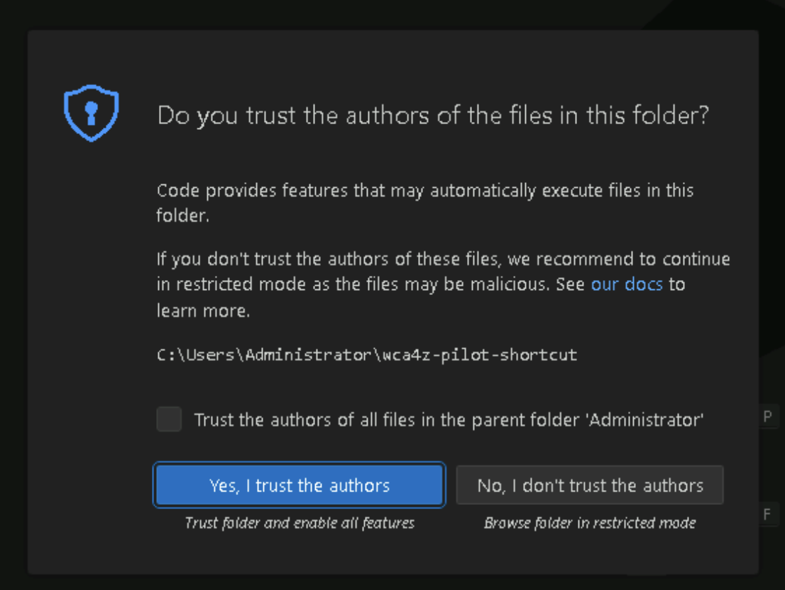
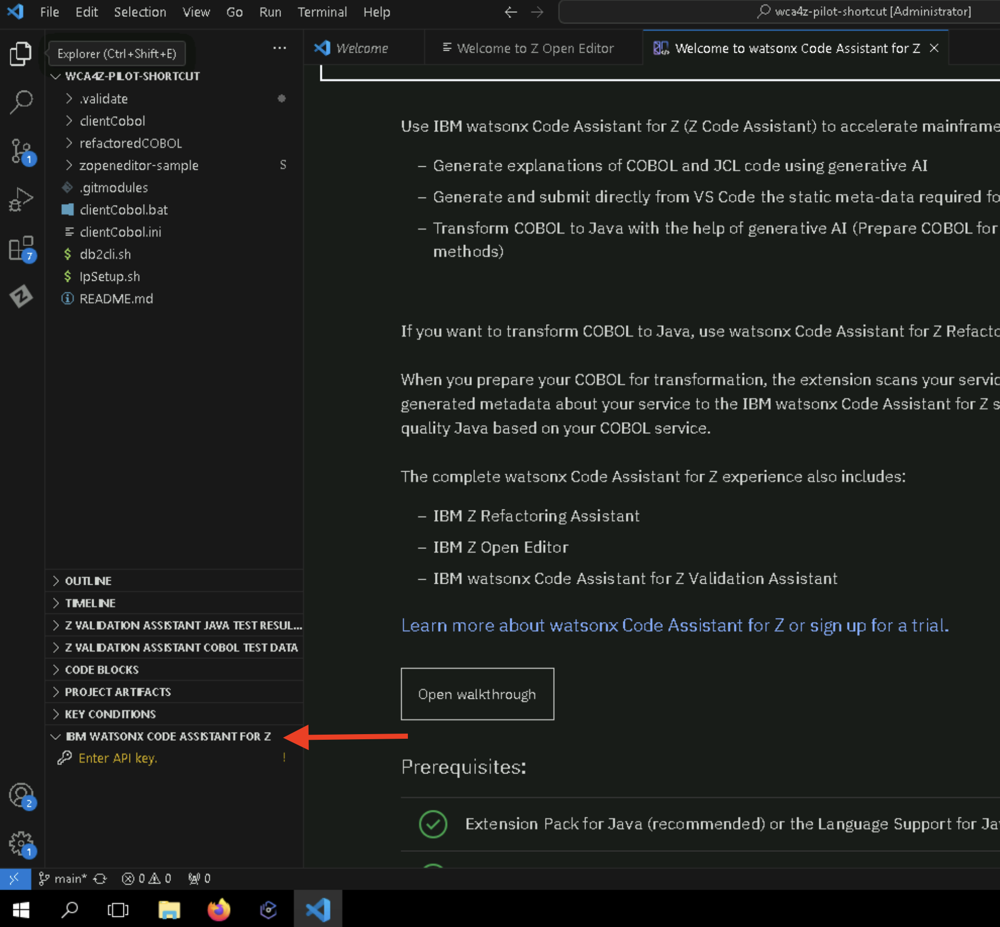
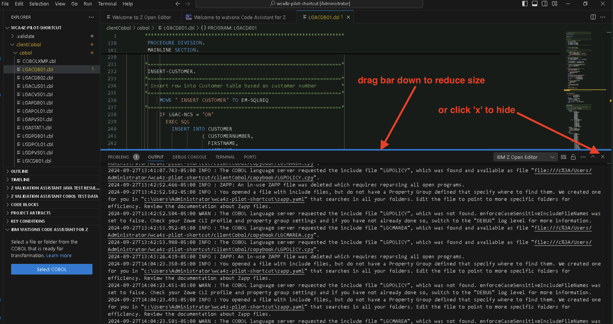

# Code Explanation

## Overview of the Code Explanation Phase

The purpose of the *Code Explanation*  phase is to understand your code. You may need to do that for a number of reasons such as learning, troubleshooting, documentation, testing, maintenance, and modernization. This capability takes advantage of generative AI based on IBM's Granite foundation model in order to explain in natural language what your code is doing, whether it's COBOL or JCL.

In order to generate explanations, all you need to do is highlight the area of code for which you want to generate an explanation, right click, and select a **simple**, **detailed**, or **guided** explanation type.

- Simple: A simple summary explanation provides the business purpose and a high-level summary of code function.
- Detailed: A detailed explanation provides the business purpose, the inputs, outputs, and key data records, as well as a detailed functional summary of code function.
- Guided: A guided explanation provides the business purpose and a step-by-step description of the code function.

## COBOL Code Explanation

### Connecting to the watsonx Code Assistant for Z LLM

Code explanations are generated by the watsonx Code Assistant for Z LLM running in IBM Cloud. In order to connect your lab environment to the LLM, you will need to enter an API key into your Visual Studio Code instance. This API key will be provided by your lab instructor.

1. Log in to your TechZone lab environment. You can find connection details on the [Lab Assignments](../lab-assignments.md) page.
2. On your TechZone lab environment's desktop, find the *Git bash* icon and double-click it in order to open up a terminal window:

    

2. **_Optional_**: By default, the font size in the terminal window you just opened is rather small.  If you would like to increase it,  click on the upper right corner of the window, choose *Options...* and then *Text* and you will be able to modify the font size to your liking.   The next few instructions will show screen snippets after the font size was doubled from *9 pt* to *18 pt*.

3. In your terminal window, enter the following command, which will download a GitHub repository owned and maintained by Garrett Woodworth, one of our instructors:

    `git clone https://github.com/siler23/wca4z-pilot-shortcut`

    The screen snippet below shows the command and its expected output:

    

4. Enter the following command which changes into the top-level directory of the repository you just downloaded and then lists this directory.  In this lab you will be working within the *clientCobol* directory.

    `cd wca4z-pilot-shortcut && ls`

    The screen snippet shows the command and its expected output:

    

5. Enter the folowing command into your terminal window:

    `code . && exit`

    This command will open up Visual Studio Code (VS Code) within your current directory (the `.` in `code .` means "use the current directory"), which is the top-level directory of your clone, and if this is successful it will close your terminal window.  (The `&&` is a logical AND so it only executes the following `exit` if VS Code opens successfully).  The Git bash terminal window is not needed for the rest of the lab but if you wish to keep it open, just omit the `&& exit`.

6. Click the blue button labeled _Yes, I trust the authors_.  

    **Note:** You must choose this in order for the *watsonx Code Assistant for Z* VS Code extensions to work properly.

    {width="553" height="416"}

7.  At the bottom Explorer pane on the left, expand the *IBM WATSONX CODE ASSISTANT FOR Z* section if it is not already expanded.

    You should see a prompt to *Enter API key*.

    

4.  On your workstation, i.e., not within your lab system, copy the instructor-provided API key into your workstation's clipboard using *Ctrl-C*.  The instructor will give you directions on where to find this key. 

5.  Back within your lab system, click the *Enter API key* prompt. A notification box may open in the lower right (not shown in screen snippet) asking you to confirm that you want to create a new authentication session for *IBM watsonx Code Assistant for Z*.  Click **Yes**.  An input bar will appear in the top-middle of the page. Paste the instructor-provided API key from your workstation clipboard with *Ctrl-V* and press *Enter*.

    

    If this was successful, the *Enter API key* prompt should disappear and you should see a message popup in the lower right that says *Successfully connected to watsonx platform authenticator*.

### Generating COBOL Code Explanations

**Note:** You may see some minor differences in the screen snippets in this section from what you will see on your system.  For example, in the screenshots the **CLIENTCOBOL** folder appears in all uppercase, while on your system it may appear as **clientCobol**.  Any differences you notice should not affect your ability to complete the lab with these instructions.  Please don't hesitate to ask your instructor for help!

1. In the top of the Explorer pane on the left, expand the *clientCobol* folder and then the *cobol* folder underneath that, if it they are not already expanded. You will see a selection of COBOL programs that end with `.cbl`.

    

2. Left-click on the file named `LGACDB01.cbl` to open it in the editor window. 

    **Note:** The first time you do this, you may receive a popup notification in the lower right about the creation of a *ZAPP file*.  You may close this window or allow it to disappear on its own.   An output area with messages may also appear and take up much of your VS Code screen. You can reduce the size of the message area or hide it completely.  See the below screen snippet for hints:

    

    Scroll down to line 232 in the code which contains the string `INSERT CUSTOMER.`

    

3. Highlight the `INSERT CUSTOMER` paragraph which is lines 232 through 304 of `LGACDB01.cbl`

    *Tip*: Rather than clicking and dragging your cursor, it may be easier to highlight all of line 232, then holding your `SHIFT` and Down Arrow keys.

4. Right-click on the highlighted lines, hover over the "watsonx Code Assistant for Z" option, and select "Generate Simple Explanation".

    

    A new tab will open on the right side of the screen with the generated explanation.

    

5. Repeat the previous step to generate *Detailed* and *Guided* explanations of the same COBOL paragraph.

    You should notice an increase in the level of detail in the Detailed and Guided explanations compared to the Simple explanation.

    Code Explanation provides the ability to regenerate the explanation, download it, insert it into the COBOL code as a comment, or copy it.

    

In the *Code Explanation* phase, 

1. We learned more about what the `INSERT CUSTOMER` paragraph is doing in the LGACDB01 COBOL program.
2. We created simple, detailed, and guided explanations of the paragraph.
3. We learned how to insert these explanations into the code as comments or download them for external use.
