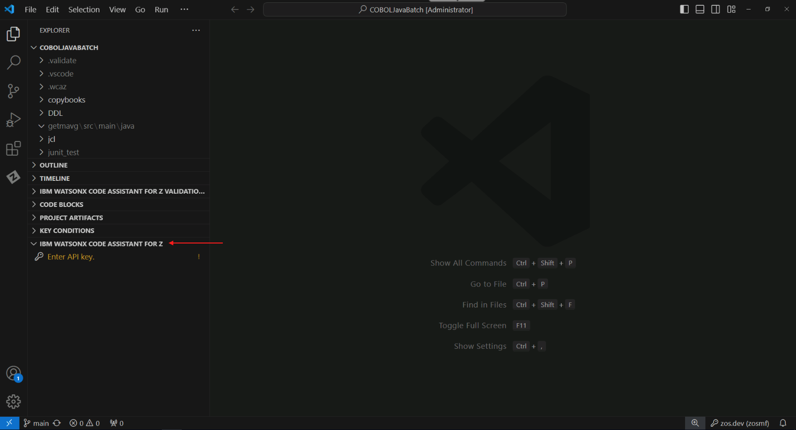

# Explain

## Overview of the Explain Phase

The purpose of the Explain phase is to understand your code. You may need to do that for a number of reasons such as learning, troubleshooting, documentation, testing, maintenance, and modernization. This capability takes advantage of generative AI based on IBM's Granite foundation model in order to explain in natural language what your code is doing, whether it's COBOL or JCL.

In order to generate explanations, all you need to do is highlight the area of code for which you want to generate an explanation, right click, and select a **simple**, **detailed**, or **guided** explanation type.

- Simple: A simple summary explanation provides the business purpose and a high-level summary of code function.
- Detailed: A detailed explanation provides the business purpose, the inputs, outputs, and key data records, as well as a detailed functional summary of code function.
- Guided: A guided explanation provides the business purpose and a step-by-step description of the code function.

## COBOL Code Explanation

### Connecting to the watsonx Code Assistant for Z LLM

Code explanations are generated by the watsonx Code Assistant for Z LLM running in IBM Cloud. In order to connect your lab environment to the LLM, you will need to enter an API key into your Visual Studio Code instance. This API key will be provided by your lab instructor.

1. Log in to your Velocity Pilot environment. You can find connection details on the [Lab Assignments](../lab-assignments.md) page.
2. In your Velocity Pilot environment, open Visual Studio Code (VS Code) from the Desktop.

    

3.  At the bottom Explorer pane on the left, expand the *IBM WATSONX CODE ASSISTANT FOR Z* section if it is not already expanded.

    You should see a prompt to *Enter API key*.

    

4.  On your workstation, i.e., not within your lab system, copy the instructor-provided API key into your workstation's clipboard using *Ctrl-C*.  The instructor will give you directions on where to find this key. 

5.  Back within your lab system, click the *Enter API key* prompt. An input bar will appear in the top-middle of the page. Paste the instructor-provided API key from your workstation clipboard with *Ctrl-V* and press *Enter*.

    

    If this was successful, the *Enter API key* prompt should disappear and you should see a message popup in the lower right that says *Successfully connected to watsonx platform authenticator*.

### Generating COBOL Code Explanations

1. In the top of the Explorer pane on the left, expand "CLIENTCOBOL" if it is not already expanded. You will see a selection of COBOL programs that end with `.cbl`.

    

2. Left-click on the file named `LGACDB01.cbl` to open it in the editor window. Scroll down to line 232 in the code which contains the string `INSERT CUSTOMER.`

    

3. Highlight the `INSERT CUSTOMER` paragraph which is lines 232 through 304 of `LGACDB01.cbl`

    *Tip*: Rather than clicking and dragging your cursor, it may be easier to highlight all of line 232, then holding your `SHIFT` and Down Arrow keys.

4. Right-click on the highlighted lines, hover over the "watsonx Code Assistant for Z" option, and select "Generate Simple Explanation".

    

    A new tab will open on the right side of the screen with the generated explanation.

    

5. Repeat the previous step to generate *Detailed* and *Guided* explanations of the same COBOL paragraph.

    You should notice an increase in the level of detail in the Detailed and Guided explanations compared to the Simple explanation.

    Code Explanation provides the ability to regenerate the explanation, download it, insert it into the COBOL code as a comment, or copy it.

    

In the *Explain* phase, 

1. We learned more about what the `INSERT CUSTOMER` paragraph is doing in the LGACDB01 COBOL program.
2. We created simple, detailed, and guided explanations of the paragraph.
3. We learned how to insert these explanations into the code as comments or download them for external use.