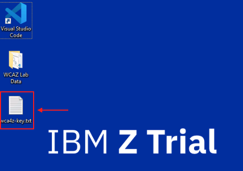
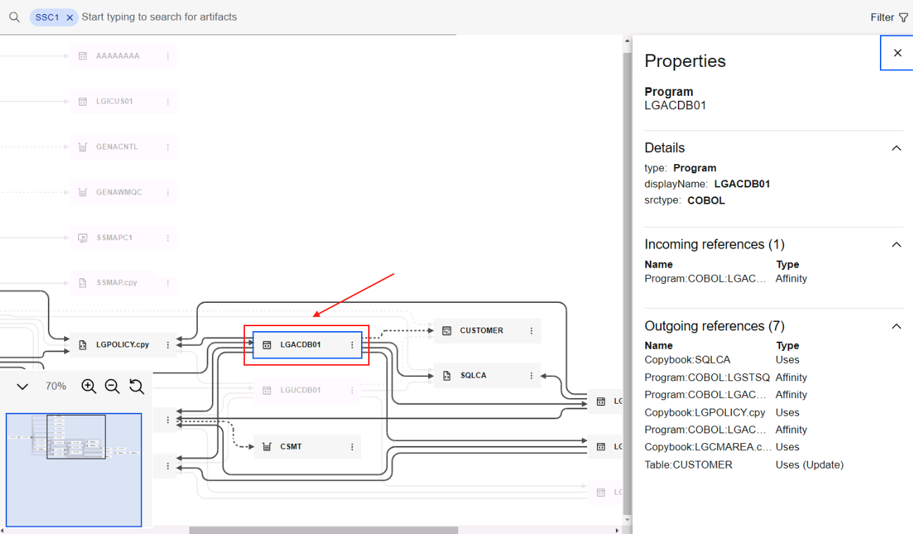
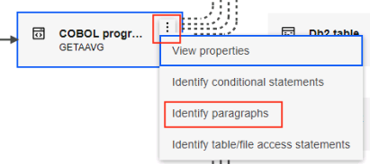
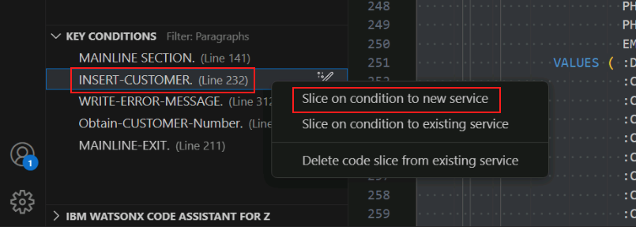
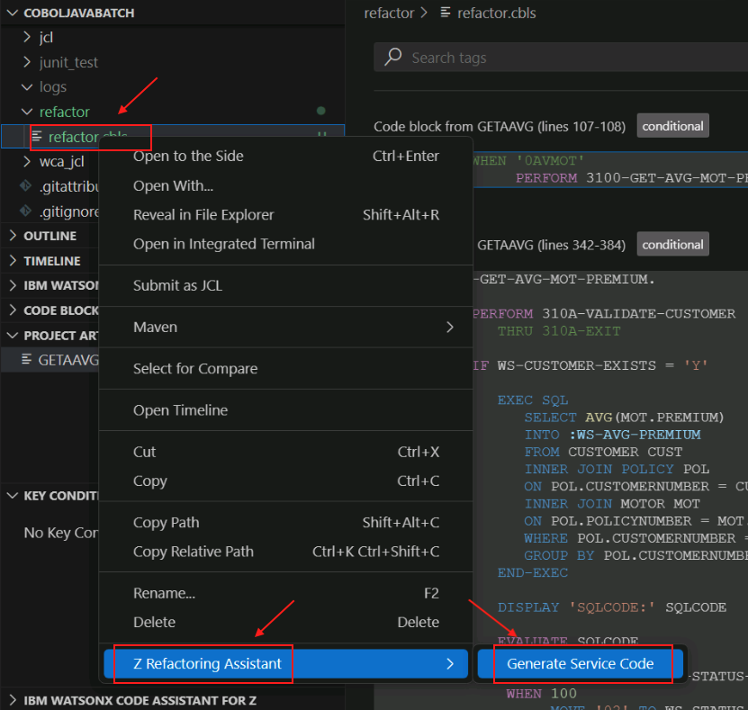

# Refactor Phase
## Refactor your COBOL Programs using Refactoring Assistant
First, you will access the Refactoring Assistant in your zVA environment.

1. Open *Visual Studio Code* (VSCode) from the desktop shortcut on the RDP browser.

    

2. In VSCode at the bottom of the left-side Explorer menu, expand the `IBM WATSONX CODE ASSISTANT FOR Z` section.

    You should see a prompt to `Enter an API key`.

    

3. Navigate to the Desktop of your zVA environment and open the text file named `wca4z-key.txt`.
   
    

4.  Copy the API key from the text file and navigate back to VSCode.
    
    

5.  Click the prompt to `Enter an API key`. An input bar will appear in the top-middle of the page. Paste the API key that you just copied from the text file and click enter.

    

    The `Enter an API key` prompt should disappear if this was successful.

6.  Click the user icon in the bottom-left corner of VSCode, and select the option to `Sign in with IBM ADDI to use IBM watsonx Code Assistant for Z Refactoring Assistant`.

    

    A new tab will open in VSCode with a login prompt.

7.  Log in with the following credentials:

    - Email address: `dev@wca4z-ra.ibm.com`
    - Password: `password`

    

    After logging in, a new input field will appear in the top-middle of VSCode to select a project.

    

8.  Select the `GenApp` option in this new field.

    Another new page will open with an option to search for artifacts within the GenApp project. 

9.  Click the search bar, click the dropdown that currnently says `All artifact types`, and select `CICS transactions`.

    

10. From the list of CICS transactions select `SSC1` and press enter.

    

    A graph showing the dependencies for the `SSC1` transaction will appear.

    

11. Click the `LGACDB01` paragraph to get the flow of its program dependencies.

    

12. Click on the 3 dots associated with the `LGACDB01` program and select the `Identify paragraphs` option.

    

    This will open the COBOL code for the `LGACDB01` program in VSCode as well as all of the paragraphs in the code sorted in order of importance/complexity in the bottom-left *Key Conditions* section.

    

13. Optionally, select the `INSERT-CUSTOMER` paragraph under Key conditions to jump to the paragraph in the `LGACDB01` program code.

    

14. In the *Key Conditions* section, right-click the `INSERT-CUSTOMER` paragraph and select the option to `Slice on condition to new service`.

    

15. A new input field will appear in the top-middle of VSCode with a prompt to `Enter service name`.
16. Provide a service name of `refactor` and press enter.

    

17. The code will be sliced into new service named `refactor` and will open in a new tab on right side of VSCode. You can close this `refactor` tab.

    

18. In the left-side menu of VSCode under the `refactor` folder, find `refactor.cbls`.
19. Right-click `refactor.cbls`, hover over the option for `watsonx Code Assistant for Z Refactoring Assistant` option, and select `Generate Service Code`.

    

20. A new input field will appear in the top-middle of VSCode prompting you to `Enter a service program name`. 
21. In this field, type `LGAOCD01` and press Enter.

    

    A new tab will open with the refactored code, `LGAOCD01.cbl`.

    

    If it does not automatically open, double click `LGAOCD01.cbl` from the left-side menu to open it.

    <!--- TODO: summarize what just happened/what this refactored code is. --->

In the *Refactor* phase, 

1. We used knowledge about our sample application, GenApp, from the *Understand* phase to select the `LGACDB01` COBOL program.
2. We used IBM watsonx Code Assistant for Z Refactoring Assistant to refactor the `INSERT-CUSTOMER` functionality by slicing code `LGACDB01` into service code.
3. This service code will be used in following *Transform* phase.
