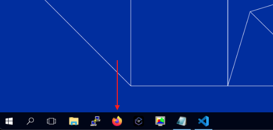
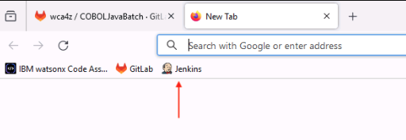
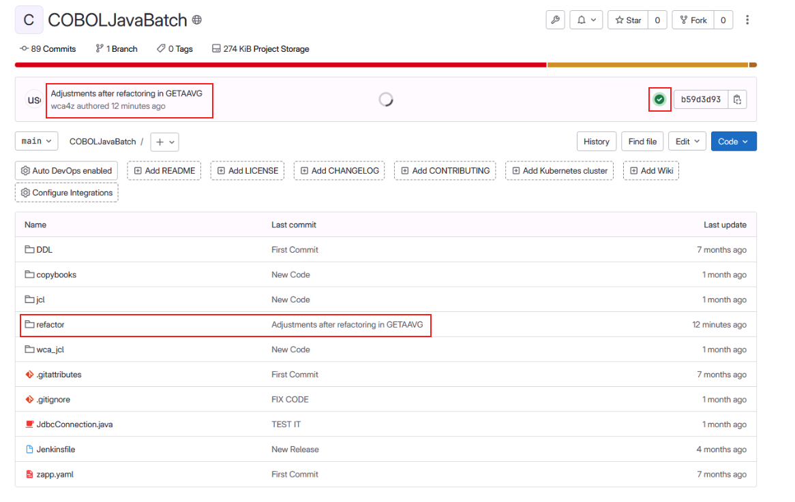
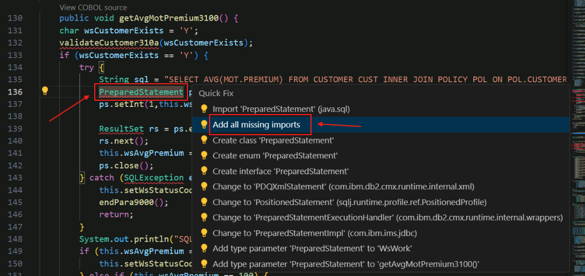
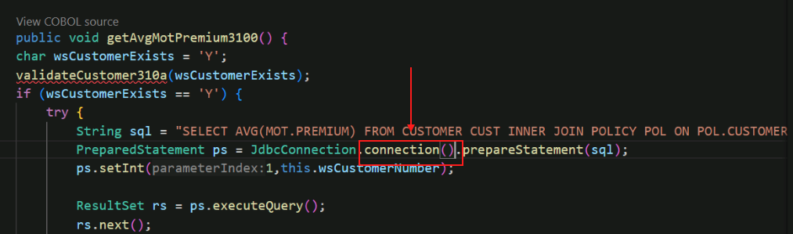

# Transform Phase

## Overview of the Transform Phase

In the transform phase, refactored COBOL code is transformed to Java with the aid of generative AI.
This transformation is a three-step process.

First, Java classes are created to implement a data model based on COBOL group items and SQL tables identified in the source code, and Java classes are created to implement the business logic.  The methods within the business logic implementation classes are provided as stubs- that is, they are empty. This step is performed by traditional programming logic- in other words, the generative AI model is not used in this step.

In the second step, the business logic is created in Java by the gnerative AI model, and these results from the model are used to fill in the business logic methods that were created empty in the previous step.  This is done by sending the source COBOL paragraph to the watsonx Code Assistant for Z service running in IBM Cloud, where this paragraph is combined with program metadata information stored in an IBM Db2 service on IBM Cloud, to form the prompt to the generative AI model.   The AI model returns Java code based on this prompt.

In the third step, the Java developer, with help from the COBOL developer if necessary, makes any necessary changes to the returned Java code to ensure that it is compilable and that it performs the function it is expected to perform. 

## Open Gitlab and Jenkins tabs in Firefox

Before we start the transformation process in VS Code, you are going to open two tabs in Firefox- one for Gitlab (a Git-based code repository) and one for Jenkins.  Jenkins is an open source automation tool to aid with DevOps and Continuous Integration and Continuous Delivery (CI/CD). *Watsonx Code Assistant for Z* is designed to integrate with your DevOps processes, and is ideally suited to a Git-based workflow.  This lab environment exemplifies this by using Gitlab as its Git-based code repository and Jenkins as its DevOps automation tool.

2. Save the changes in *GETMAVG.cbl* by choosing *File->Save* from the VS Code menu.

3. Open the Firefox browser in your zVA instance.

    

4. Click the *GitLab* bookmark from the bookmarks toolbar.

    

5. The GitLab page will prompt you for login credentials. Click the *Username or primary email* field, select the *wca4z-git* saved credentials, and click *Sign in*.

    

    After successfully logging in to GitLab, the GitLab Projects page will open. 

6. Open the Project named *wca4z/COBOLJavaBatch*.

    

7. Feel free to peruse the files currently included in the project.  The most noteworthy thing is that there are no COBOL program source files- files ending in *.cbl*- at the moment.  This situation will change- you will commit the refactored COBOL code to this project soon.

    

8. Open another new tab in the web browser and click the *Jenkins* bookmark from the bookmarks bar.

    

9.  The Jenkins login page will appear. Select the saved credentials for *wca4z-jenkins* and click *Sign in*.

    

10. After successfully logging in, the Jenkins Dashboard will appear. The project you'll be working with is named *ADDIBuildWCA4ZProject*. 

    

11. Click *ADDIBuildWCA4ZProject* and see that no previous builds have been run, as indicated in the lower left where it should say *No builds* in the *Build History* box, as shown in this screen snippet:

    


## Transform the Refactored Service Code from COBOL to Java

Now we'll get back to VS Code to begin the COBOL to Java transformation process.

12. Navigate back to VS Code. In the far left side of the screen, click the *Source Control* icon.

    

13. Click the *+* sign in the *Changes* section of the VS Code Source Control page to stage the refactored COBOL program (*GETMAVG.cbl*) and the JSON file containing the information about the service (*refactor.cbls*).

    You may need to hover over the *Changes* line in order for the *+* sign to appear.

    

    If done correctly, the changes will move to the *Staged Changes* section.

    

14. Add a commit message for the changes. E.g., `Adjustments after Refactoring in GETAAVG`. **Pro tip:** You can put whatever you want for a comment, but you have to put in at least one character.

15. Click the *Commit & Push* button.

    

16. A new pop-up will appear prompting you for GitLab credentials. Enter the following and click *Continue* to log in.

    - Username: `wca4z-git`
    - Password: `P@assw0rd`
  
    { width="365" height="286" }

    After doing so, your changes should be committed and pushed to the GitLab repository.

17. Navigate back to the Jenkins page in your web browser.

18. You should see a new job that was automatically triggered with your pushed changes. Wait until all stages of the job are completed successfully.  Greenish colors are good and reddish colors are not so good. 

    

19. Click the Build number from the list on the left, and then click *Console Output*.

    This could be *#2* or *#3*, for example. 

    
    

    The log for the job will appear.

20. Look through the job log to see the actions that were performed.

     
    
    This Jenkins build was triggered by the commit you made to GitLab.  The purpose of the build is to create metadata information that is used by the watsonx Code Assistant for Z service on IBM Cloud.  This metadata information will be combined with a COBOL paragraph's source code to form a prompt to the large language model (LLM). The LLM returns Java code based on the prompt.  

    Scroll through the *Console Output*, and look for: 

    `DELETE FROM EZSCH.WCAZCATALOG`

    *EZSCH.WCAZCATALOG* is the Db2 table that will contain the metadata information about the refactored COBOL code.  This table is created the first time that the process that creates the metadata information is run.   The message *SQL0204N  "EZSCH.WCAZCATALOG" is an undefined name* indicates that this table does not exist.  That message is okay and is expected since this is the first time this Jenkins build has run- the Jenkins build includes a step to delete all the rows because at the end of the build new rows will be inserted based on the refactored COBOL code that you have committed.  If you were to do another commit (which you won't have to do if the lab works perfectly but you might have to do for debugging reasons) then you would see different messages after the *DELETE FROM* because now your table does exist.

    Look for messages like this:

    ```
    Found an updated file: "GETMAVG.cbl"
    Resolved path to file: "C:\data\GIT_REPOS\refactor\cobol\GETMAVG.cbl"
    Adding program "GETMAVG" to import queue

    Populating additional metadata for WCA4Z from ADDI and DDL

    Populating metadata for program GETMAVG
    Generating PrimaryKeys.csv and ForeignKeys.csv
    Importing data into the database
    Done.
    ```

    The program that you committed, *GETMAVG.cbl*, was detected, and metadata about the program, including information about the primary keys and foreign keys of the Db2 tables used by the program, is written to the database that watsonx Code Assistant for Z uses to help construct the prompt to the LLM.

    **Note:** The Jenkins pipeline that is running here is not provided with *watsonx Code Assistant for Z*.  The pipeline takes advantages of components provided by *watsonx Code Assistant for Z*, but the pipeline itself is tailored to this lab environment.  There are other ways to create and store this metadata information, and in fact the way that it is created and stored has changed from version 1.x to version 2.x of *watsonx Code Assistant for Z*. This lab doesn't go into detail on this topic.

21. Navigate back to the GitLab tab in the browser and refresh it.

     

    You should see a few changes.
    
    - a new commit with a green check mark, and
    - a new *refactor* folder that was not present before
  
22. Open the *refactor* folder in the GitLab browser page, then open the *cobol* sub-folder.

    The *GETMAVG* code will now be present.

     

    **Let's review** Here's what transpired in the last several steps (from step 14 up to this point):

    - When you did the *Commit and Push* in step 4, it pushed the changes you made with Refactoring Assistant up to the source code repository on your Gitlab server
    - This triggered the Jenkins pipeline which executed a series of steps.  The purpose of these steps was to inspect the code changes, incorporate them into an ADDI project associated with your source code repository, create metadata information that will be used for transforming the COBOL code to Java, and writing this metadata information to the IBM Cloud Db2 service that the watsonx Code Assistant for Z service uses.

23. Navigate back to VS Code.

24. Click the *Explorer* icon in the upper left, then, within the *refactor/cobol* folder, right-click the *GETMAVG.cbl*, hover over *watsonx Code Assistant for Z*, and choose *Select COBOL for transformation*. 

     

    Note: the same task can be performed by selecting the *Import COBOL* button in the bottom-left corner of VS Code under the *IBM WATSONX CODE ASSISTANT FOR Z* section.

    Either way, the *GETMAVG.cbl* file should now be present in the *IBM WATSONX CODE ASSISTANT FOR Z* section in the bottom left of VS Code.

25. In the *IBM WATSONX CODE ASSISTANT FOR Z* section in the bottom left, click the icon next to *GETMAVG.cbl* to *Generate Java classes*.

     

    A new input bar will appear in the top middle of VS Code, prompting you for a Java directory,

26. Select *Input absolute path*, click in the blank space on the right side of the input field to remove the highlight from the default path, and then add the following to the end of the default path: `\getmavg\src\main\java`.

    The absolute path should be the following:

    `c:\Users\Administrator\Desktop\WCA4Z Lab Data\COBOLJavaBatch\getmavg\src\main\java`

     

27. Press *Enter*

    A new tab for *Java Class design* should open.

     

    The metadata information that was just created from the Jenkins pipeline was used to construct the information that is presented to you in this tab.

    Here is a recap of the classes that are being created:

    1. A Java class in the *datamodel* package was created for each of the three Db2 tables referenced in the code: *Customer*, *Motor*, and *Policy*. The variables in each class correspond to the columns in the Db2 table.
    2. A Java class was created in the *implementation* package corresponding to the name of our refactored COBOL program- *Getmavg*.
    3. For each *01-level group item* in the refactored COBOL program, a class is created in the *implementation* package- in our case, *WsWork* and *WsInRec*, which correspond to the COBOL group items *WS-WORK* and *WS-IN-REC*, respectively.

28. Expand the different artifacts using the down arrows. Keep all of the default values.

    Notice that there are methods listed under the *Getmavg* package and the *WsWork* package. These are java methods that will correspond to COBOL paragraphs from the refactored COBOL program.  *Watsonx Code Assistant for Z* placed some of the methods in the *Getmavg* class and some in the *WsWork* class. Those classes that manipulate a group item are candidates to be placed in the class for that particular group item (e.g., *WsWork*) instead of in the class named for the refactored COBOL program (e.g., *Getmavg*).

    { width="650" height="791" }

29. At the bottom right of *Java Class design* tab, click *Generate Java classes*.

     

30. In the left side menu of VS Code, navigate to the *getmavg\src\main\java\com\ibm\wcaz* folder to see the list of generated Java classes.

31. Copy the *JdbcConnection.java* file into the *implementation* folder, *\getmavg\src\main\java\com\ibm\wcaz\implementation*.  The easiest way to do this on the zVA is probably to *right-click and copy* against *JdbcConnection.java* and then on the *implementation* folder name do *right-click and paste*.  Trying to drag and drop defaults to *move* instead of *copy* which is why we advise to use *right-click* context menus instead of drag and drop. We're asking you to copy for debugging purposes only- in case we instruct you to remove the *implementation* folder during problem determination steps, it is good to have the original copy.

    

    JDBC stands for Java DataBase Connectivity.  The details for configuring a connection from Java programs to data bases may be standardized for a company, and this program exemplifies using a particular class for the connectivity.  So the Java developer will use this class and you will see in a later step how they must make minor changes to the code returned by the Large Language Model (LLM) in order to work with this class.

32. When you copied the file in the previous step, VS Code extensions for Java activated since this was the first time in the lab instructions you worked directly with a java file.  **Note:** It is possible that you looked at some java files on your own out of curiousity a little while ago and the actions taken by VS Code as described in this step may already have occurred.

    <!---  --->

    A new section named *JAVA PROJECTS* will appear at the bottom-left of VS Code and the Java projects will be generated.

     

    You may need to expand the *JAVA PROJECTS* section to see the projects. You aren't really going to take specific actions within the *JAVA PROJECTS* section, so you can collapse this section when you're done perusing it. What is important here is to wait for the message *Java: Ready* to appear in the lower left of VS Code.  It may take a couple of minutes for things to settle down to the point where you see *Java: Ready*. 
    **Important:** Wait for the message *Java: Ready* to appear. 

    { width="424" height="244" }

32. The Java classes and method names can be found in the *refactor\cobol* folder in the *IBM WATSONX CODE ASSISTANT FOR Z* section. 

     

    You may need to expand the *IBM WATSONX CODE ASSISTANT FOR Z* section to see the classes and methods. 

33. In the *refactor\cobol* folder, click on the method named *getAvgMotPremium3100*.

     

    The source code for *WsWork.java* is displayed and the *getAvgMotPremium3100* method is highlighted.  Notice that the body of this method is empty- there is nothing betwen the curly brackets *{}*.  This empty method was set up during the *Generate Java classes* action you took moments ago with the expectation that the contents of the method will be generated by the LLM.  This is what happens during the *Generate Java method* action that you will be performing on each empty method.

34. In the *refactor\cobol* folder, click the icon next to the *getAvgMotPremium3100* filename to generate the Java method.

     

    <!--- Note: if this returns an error, try to close out of the java files in the editor. --->

    The large language model (LLM) will begin to generate Java code for the *getAvgMotPremium3100* Java method which matches the functionality of the *3100-GET-AVG-MOT-PREMIUM* COBOL paragraph.

35. After the Java method gets generated in the right-side panel, click the *Insert* button. 

     

    The generated Java code *getAvgMotPremium3100* will be inserted into the body of the method.

     

    In the left side menu, you can see that *getAvgMotPremium3100* now has a check mark next to its icon. (Look closely, this is a small check mark on a tiny icon, so it is a bit of an "eye test".) This indicates that the method has been generated.
    Now that you've inserted the Java code into the method, you can close the *Java method generation* tab to reduce clutter in the VS Code window.

     

36. Repeat this process (steps 23-25) for the remaining methods, one method at a time, until they are all checked off.

     

## Fix problems identified in the generated Java code

It is anticipated that the code returned from the LLM will not be perfect and ready to be run without change.  There will very likely be problems in the Java code that will be identified in VS Code.  The problems will typically fall into one of these categories:

-  problems that are trivial to fix, and often can be fixed by a *Quick fix* offered by VS Code, such as missing imports
-  problems that require a little bit of investigation by the Java developer but are within the knowledge domain of the Java developer
-  problems that may require some knowledge of the original application and thus may require some collaboration with the COBOL application developer

**Note:** The LLM used by watsonx Code Assistant for Z is constantly improved and is updated frequently.  It is expected that the number of problems to resolve will decrease over time as the LLM improves- in fact, **there is always the chance that recent model updates might cause the results that are returned during the lab to differ from what is documented here, in which case the instructions as shown here may not work correctly!  If this occurs, the instructors will tell the students during the lab what alterations to the lab instructions are necessary in order to resolve the problems. (Or they'll tell you to go home early if they can't figure it out.)**  The remainder of this section lists the problems that we expect you to have to contend with, subject to the previous disclaimer.

1. Select *View->Problems* from the VS Code menu to see a list of problems in the bottom portion of VS Code.    

    

    You do not need to worry about every problem identified, just the ones in *WsWork.java* and *Getmavg.java* which are the two Java classes that contain methods that were generated by the LLM.

37.  Let's start with the errors in *WsWork.java*. 

     We expect that you will receive a few errors of the type *NAME cannot be resolved to a type* where *NAME* will be *PreparedStatement*, *SQLException*, and *ResultSet*. These are easy to fix all at once- click on any one of these errors in the *Problem* view, and you will be taken to its occurrence in the code window.  Hover over the red-underlined text associated with the error, click *Quick fix*, and select *Add all missing imports*.  By choosing *Add all missing imports*, it will attempt to implement the fix for all of these missing types, one at a time.  See the screen-snippet below for hints on how to do this:

    

    **Note:** Be alert for a prompt at the top of your VS Code window which may appear if multiple Java libraries configured on your system offer this class. If prompted, select the option that starts with *java.sql* for each import.

38. Still within the *WsWork.java* file, you may see two problems for *connection cannot be resolved or is not a field*. This is needed because the *JDBCConnection.java* class we are using does not provide a *connection* object, but rather a *connection* method.  This is an example of how a company-specific detail (e.g., using a company-mandated JDBC Connection class) might require a modification to the generated code. To resolve this, for each problem, click on it to be taken to the code, then, manually change `connection` to `connection()`.  The screen snippet below shows where to make this change in the *getAvgMotPremium3100()* method, but you will have to make this change in the *validateCustomer310a()* method as well.

    


39. You may notice a new problem has appeared under *WsWork.java*-  *Unhandled exception type ClassNotFoundException*.  This occurred when you changed *connection* to *connection()*.  You made that change in two places but you only received this problem once.  The problem is applicable to both places, but the tooling won't recognize it in the *getAvgMotPremium3100()* method until you resolve the *sqlCode cannot be resolved to a variable* problem, which we'll cover in the next step.  After that is resolved, we'll tell you how to fix the *ClassNotFoundException*-related problem.

40. If you have errors in *getAvgMotPremium3100()* stating that `sqlcode cannot be resolved to a variable`, similar to what is shown in the screen snippet below, read the instructions below the screen snippet for advice on how to remediate this.  Follow the instructions carefully, you will do more typing or cutting and pasting in this step than any other step in the lab.

    
    
    This `sqlcode` Java variable originated from the COBOL variable `SQLCODE` which is defined in the `SQLCA` group data item. This variable holds the result of a SQL call.  In Java, a non-zero SQL code can be retrieved from the *getErrorCode()* method of the *SQLException* class.  Thus, one way to resolve this unreferenced variable is to move the handling of it into the *catch* clause that handles a *SQLException*.   Right now, the *sqlCode* variable is being checked after the *try/catch* statement.  We think we can improve upon the model's output here. Remember, *watsonx Code Assistant for Z* is an *assistant*- you are the boss, and you can overrule your assistant.

    The following set of instructions will provide guidance to help you to move the `sqlcode` variable to the *catch* clause, where it belongs, improving the code and resolving the problem.  To perform these steps you may have to do some typing, some cutting and pasting, and some deletions. This is probably the most difficult step in the lab- take care when performing this step, but, to be safe, we've included the complete source code for the *getAvgMotPremium3100()* at the end of this step for your reference.

    All three of the *sqlCode cannot be resolved to a variable* problems are very close to each other in the code.  Click on any one of them from the *Problems* view to be taken to the area of the code that you will be modifying.  Just above where these errors occur, you'll notice a *catch* clause.  Change this catch clause of the SQLException from

    ```
    } catch (SQLException exception) {
            this.setWsStatusCode("02");
            endPara9000();
            return;
        }

    ```
    to

    ```
    } catch (SQLException exception) {
      int sqlCode = exception.getErrorCode();
      System.out.println("SQLCODE:" + sqlCode);
      if (sqlCode == 100) {
        this.setWsStatusCode("02");
      } else {
        this.setWsStatusCode("16");
      }
      endPara9000();
      return;
    }
    ```

    This handles non-zero SQL codes by setting `wsStatusCode` to 2 for SQL Code 100 and to 16 for any other non-zero SQL Code.  (This may seem odd but it is what the original COBOL was doing.)

    Since a SQL code of zero does not cause a SQLException, we can set `wsStatusCode` to *00* prior to making the SQL call.  Add `this.setWsStatusCode("00")` at the top of the *try* clause (just a few lines above where you just matde the changes to the *catch* clause) in *getAvgMotPremium3100()*, prior to making the SQL call.  See the code snippet below for where it belongs:

    ```
    ...
      if (this.getWsCustomerExists() == 'Y') {
    try {
      this.setWsStatusCode("00");    // Insert this line at top of the 'try'
      ResultSet rs = JdbcConnection.connection().createStatement().executeQuery(
    ...

    ```

    Now you can get rid of the code shown below, just after the try/catch clause, because you set `wsStatusCode` to *00* prior to the SQL call, and you are relying on the *catch* clause to change *wsStatusCode* appropriately if a *SQLException* occurs:

    ```
            System.out.println("SQLCODE:" + sqlCode);
        if (sqlCode == 0) {
            this.setWsStatusCode("00");
        } else if (sqlCode == 100) {
            this.setWsStatusCode("02");
            endPara9000();
            return;
        } else {
            this.setWsStatusCode("16");
            endPara9000();
            return;
        }
    ```

39. At this point you should see a second *Unhandled exception type ClassNotFoundException* problem appear in your *Problems* view. 
    This problem appears because the 
    *connection()* method throws a ClassNotFoundException, which is not handled by the *try/catch* block returned by the LLM. For each of these two problems, click on them in the *Problems* view to get to where they occur in the code window, hover 
    over the red underline, click *Quick Fix*, then click *Add catch clause to surrounding try*. The red underline indicating an error should disappear. The screen snippet below gives hints from within the *getAvgMotPremium3100()* method, and you'll need to do this within the *validateCustomer310A()* method as well:

    

40. The instructions had you making several changes in *getAvgMotPremium3100()*.  In case your edits didn't go smoothly, here is what this method should now look like.  If necessary, you could delete that method in your code window and replace it with the contents of the method shown here.  You won't have to do this if your editing went smoothly.

    ```
    public void getAvgMotPremium3100() {
      this.setWsCustomerExists('Y');
      validateCustomer310A();
      if (this.getWsCustomerExists() == 'Y') {
        try {
          this.setWsStatusCode("00");
          ResultSet rs = JdbcConnection.connection().createStatement().executeQuery(
          "SELECT AVG(MOT.PREMIUM) FROM CUSTOMER CUST INNER JOIN POLICY POL ON POL.CUSTOMERNUMBER = CUST.CUSTOMERNUMBER INNER JOIN MOTOR MOT   ON POL.POLICYNUMBER = MOT.POLICYNUMBER WHERE POL.CUSTOMERNUMBER = "
              + this.getWsCustomerNumber());
          rs.next();
          this.setWsAvgPremium(rs.getInt(1));
        } catch (SQLException exception) {
            int sqlCode = exception.getErrorCode();
            System.out.println("SQLCODE:" + sqlCode);
            if (sqlCode == 100) {
              this.setWsStatusCode("02");
            } else {
               this.setWsStatusCode("16");
            }
            endPara9000();
            return;
        } catch (ClassNotFoundException e) {
            // TODO Auto-generated catch block
            System.out.println(e.printStackTrace());
        }
      } else {
        this.setWsStatusCode("08");
        System.out.println("INVALID CUSTOMER!!!");
        endPara9000();
        return;
      }
    checkIfOverpaid4000();
    }
    ```
 

41. Any problems remaining in *Getmavg.java* or *WsWork.java* should be trivial- you may see one for an import that is never used.  You may delete the unused import using a quick fix.  Our empty COBOL paragraph *1000-EXIT* was turned into an empty method except for a *TODO comment*, so you can remove the *TODO comment* from the code as well to remove this from the problem list. Similarly, the *catch* clauses you added to fix the problems from the *JdbcConnection.connection()* method may each have a *TODO comment*, so you can remove these as well. 

You should no longer have problems in the *WsWork.java* or *Getmavg.java* files indicated by red numbers next to the filenames. You may have some *warnings* or *TODOs*, but these can be ignored. All problems with the transformed Java code should be fixed, and it should be compilable now, which is a preqrequisite for the next phase, which is the *Validate* phase.

In this *Transform* phase,

1.	We used the refactored service code *GETMAVG* from the *Refactor* phase.
2.	We generated Java classes and Java methods for the *GETMAVG* service.
3.  We made necessary fixes to the LLM-generated Java code.

<!--- TODO: improve this summary --->

In the next phase, you will use **IBM watsonx Code Assistant for Z Validation Assistant** to validate that the original COBOL and transformed Java produce the same results.
