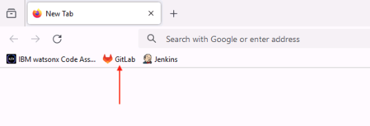
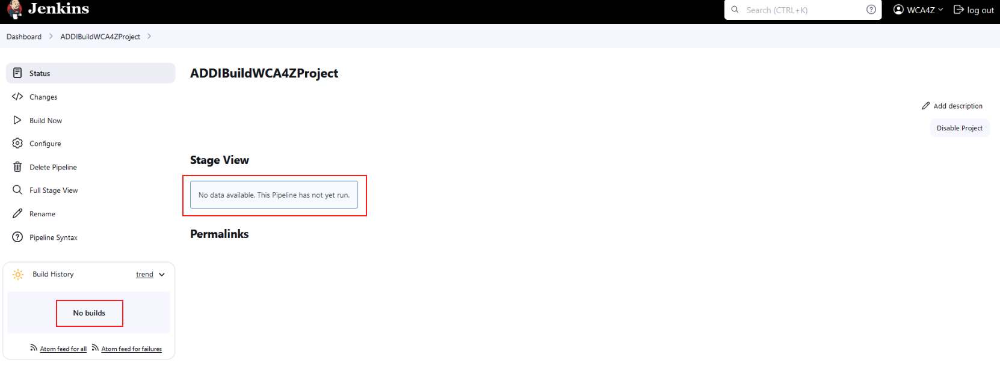
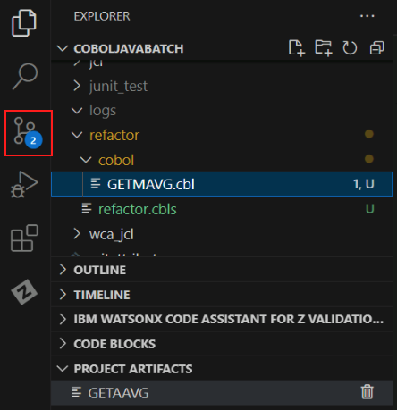
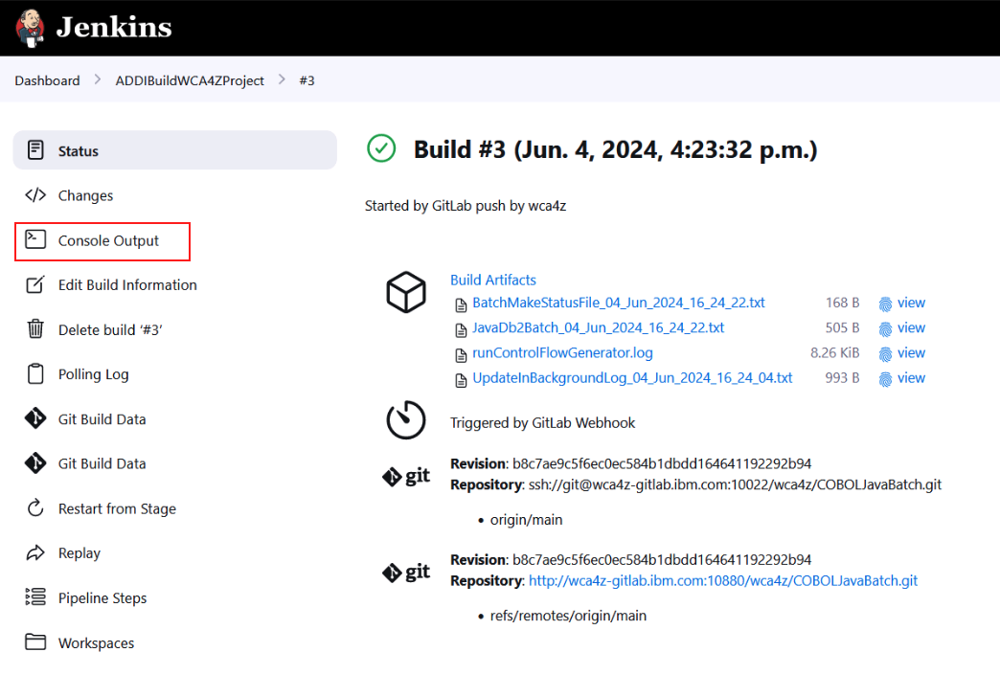
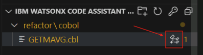
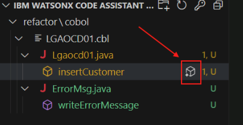
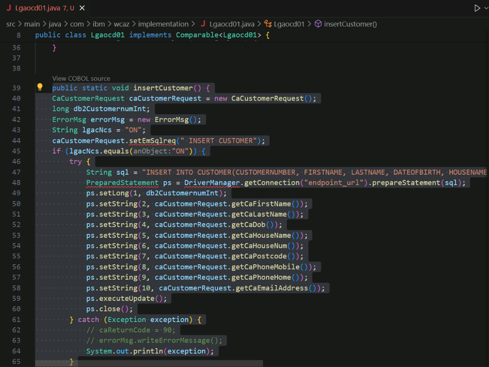

# Transform Phase
## Transform the Refactored Service Code from COBOL to JAVA
1. In your zVA instance, open the web browser.

    

2. Click the `GitLab` bookmark from the bookmarks bar.

    

3. The GitLab page will prompt you for login credentials. Click the `Username or primary email` field and select the `wca4z-git` saved credentials.

    

    After successfully logging in to GitLab, the GitLab Projects page will open. 

4. Open the Project named `wca4z/COBOLJavaBatch`.

    

5. Quickly look through all of the files included in the Project and notice that there are no COBOL components yet.

    

6. Open another new tab in the web browser and click the `Jenkins` bookmark from the bookmarks bar.

    

7. The Jenkins login page will appear. Select the saved credentials for `wca4z-jenkins` and log in.

    

8. After successfully logging in, the Jenkins Dashboard will appear with an option named `ADDIBuildWCA4ZProject`. 

    

9.  Click `ADDIBuildWCA4ZProject` and see that no previous jobs have been run.

    

10. Minimize the web browser and navigate back to VSCode. In the far left side of the screen, click the `Source Control` icon.

    

11. Click the `+` sign in the *Changes* section of the VSCode Source Control page to stage the COBOL programs and copybooks.

    You may need to hover over the *Changes* line in order for the `+` sign to appear.

    

    If done correctly, the changes will move to the *Staged Changes* section.

    

12. Add a commit message for the changes. E.g., `Adjustments after Refactoring in LGACDB01`. 
13. Click the *Commit & Push* button.

    

14. A new pop-up will appear prompting you for GitLab credentials. Enter the following and log in.

    - Username: `wca4z-git`
    - Password: `P@assw0rd`
  
    

    After doing so, your changes should be committed and pushed to the GitLab repository.

15. Navigate back to the Jenkins page in your web browser and refresh the page.
16. You should see a new job that was automatically triggered with your pushed changes. Wait until all stages of the job are completed.

    

17. Click Job number from the left-side list, and then click `Console Output`.

    This could be `#2` or `#3`, for example. 

    
    

    The log for the job will appear.

18. Look through the job log to see the actions that were performed.

     
    
    <!--- TODO: add a high level overview of what the job did. --->

19. Navigate back to the GitLab tab in your browser and refresh it.

     

    You should see a few changes.
    - a new commit with a green check mark, and
    - a new `refactor` folder that was not present before
  
20. Open the `refactor` folder in the GitLab browser page, then open the `cobol` sub-folder.

    The `LGACDB01` code will now be present.

     

21. Navigate back to VSCode
22. Right click the `LGACDB01.cbl` file, hover over `watsonx Code Assistant for Z`, and select `Select COBOL for transformation`. 

     

    Note: the same task can be performed by selecting the `Import COBOL` button in the bottom-left corner of VSCode under the `IBM WATSONX CODE ASSISTANT FOR Z` section.

    Either way, the `LGACDB01.cbl` file should now be present in the `IBM WATSONX CODE ASSISTANT FOR Z` section in the bottom-left of VSCode.

23. Click the icon next to `LGACDB01.cbl` to `Generate Java classes`.

     

    A new input bar will appear in the top-middle of VSCode, prompting you for a Java directory,

24. Select `Input absolute path`, and add the following to the end of the default path: `\src\main\java`.

    The absolute path should be the following:

    `c:\Users\Administrator\Desktop\WCA4Z Lab Data\COBOLJavaBatch\src\main\java`

     

25. Press enter.

    A new tab for `Java Class design` should open.

     

26. Optionally expand the different artifacts using the down arrows. Keep all of the default values.
27. At the bottom-right of `Java Class design` tab, click *Generate Java classes*.

     

28. In the left-side menu of VSCode, navigate to the `src\main\com\ibm\wcaz` folder to see the list of generated Java classes.

     

29. From this folder, open the file named `Lgacdb01.java`.

     

    A new section named `JAVA PROJECTS` will appear at the bottom-left of VSCode the Java projects will be generated.

     

    You may need to expand the `JAVA PROJECTS` section to see the projects.

    The Java classes and method names can be found in the `refactor\cobol` folder in the `IBM WATSONX CODE ASSISTANT FOR Z` section. 

     

    You may need to expand the `IBM WATSONX CODE ASSISTANT FOR Z` section to see the classes and methods.

30. In the `refactor\cobol` folder, open the method named `insertCustomer`.

     

31. In the `refactor\cobol` folder, click the icon next to the `insertCustomer` filename to generate the Java method.

     

    <!--- Note: if this returns an error, try to close out of the java files in the editor. --->

32. After the Java method gets generated in the right-side panel, click the `Insert` button. 

     

    The generated java method for `insertCustomer` will be inserted in the Java class.

     

33. Repeat this process for the `writeErrorMessage` function.

    

    

    

<!--- 
TODO: Show that there are problems in the Java code that need to be solved.
      Take the lab user through the process of fixing the problems, then move on to validate phase.
 --->

In this *Transform* phase,

1.	We used the workbook `LGACDB01` from *Refactor* phase for `INSERT-CUSTOMER` functionality.
2.	We generated Java classes and Java methods for the `INSERT-CUSTOMER` service.

<!--- TODO: improve this summary --->