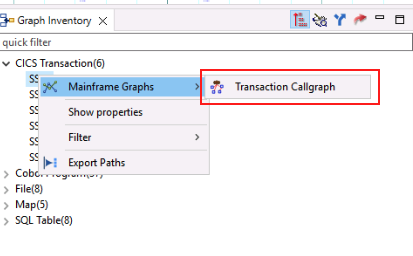

# Understand Phase
## Configuring the Refactoring Assistant
1. Log in to your IBM Z Virtual Access (zVA) environment.
    
    You should have been [provided access](../lab-assignments.md) to an environment ahead of time. If you are not sure how to access your environment, please ask your lab instructor for help.

    

2. In the zVA browser, open PuTTY from the taskbar.

    

3. In the list of PuTTY's *Saved Sessions*, select `wca4z-ra` and click *Open*.

    

4. After clicking *Open*, you will receive a security warning. Select *Accept*.

    

    This warning should only appear the first time you load the `wca4z-ra` session.
    
    Scripts will automatically run in the PuTTY session to start the Refactoring Assistant.

5. Once you receive the message `IBM watsonx Code Assistant for Z Refactoring Assistant started` in the PuTTY console, you can close PuTTY.

    

## Understanding GenApp
In this lab, you will be using the sample application **GenApp**. The general insurance application is a working CICS-COBOL application simulates transactions made by an insurance company to create and manage its customers and insurance policies.

You can read more about GenApp [here](https://www.ibm.com/docs/en/cics-ts/6.1?topic=samples-general-insurance-application) and its architecture [here](https://www.ibm.com/docs/en/cics-ts/6.1?topic=application-architecture).

6. In the zVA browser, open IBM Developer for z/OS (Idz) from the taskbar.

    

7. You may be prompted to select a directory as a workspace. If you receive this, leave the default workspace path and click launch.

    The correct workspace path should be: 

    ```
    C:\Users\Administrator\.zosexplorer
    ```

    

    The launcher window will close, and IDz will launch the z/OS Explorer workspace. 

    Please be patient. This can take a minute or two to fully load.

8. Once you see the *Explore projects* tab, right-click on the empty list of projects and click *Get Project List*.

    

    The GenApp project will appear.

    

9. Click the GenApp project to highlight it, then double-click *Program Callgraph* in the new pane that appears on the right side of the page.

    

10. A new window will appear where you can select which programs to analyze. Click the double arrow button to move all of the programs from *Available programs* to *Selected programs*, then click *Finish*.

    

    Please be patient. This can take a minute or two to fully load.

    When loaded, you will see a call graph for all programs, CICS transactions, and tables, and other files in the GenApp application and the interdependencies between them.

    

    This is an interactive chart. You can zoom in and scroll around the graph to see different objects. You can also right-click the objects to see more specific details about them.

11. In the left-side of the page, you will see a Graph Inventory. Notice that the CICS transactions, COBOL Programs, and different object types have been identified. Expand the *COBOL Programs* section to see the list of 37 COBOL programs that are part of GenApp.

    

12. In the *Graph Inventory*, expand the *CICS Transactions* section to see the 6 CICS transactions that are part of GenApp and find the one named `SSC1`.

    

13. Right-click `SSC`, hover over *Mainframe Graphs*, and select *Transaction Callgraph*.

    

14. Leave the default options and click *Finish*.

    

    A new callgraph will be generated that is scoped to only the objects in the application flow that follow the CICS transaction.

    

    At the bottom of this graph, you will notice a COBOL program named `LGACDB01` that accesses a SQL table named `CUSTOMER`. 

15. Right-click on the COBOL program named `LGACDB01` to open a new panel at the bottom with the COBOL code. Maximize the code by clicking the button in the top-right of the panel.

    

    The COBOL program `LGACDB01` should now be maximized.

    

16. Scroll down to line 242 in the COBOL code until you find the `INSERT-CUSTOMER` paragraph. 

    

    Hint: You can check the line you're on using the first number pointed out in the image above.

    The `INSERT-CUSTOMER` paragraph is one small part of the overall GenApp sample application. It is responsible for inserting customer data into the SQL table and if this fails, there is a separate paragraph named `WRITE-ERROR-MESSAGE` that is executed.

    In the following sections, you will refactor and transform these two paragraphs into Java.

In the *Understand* phase,

1. We selected the `SSC1` transaction to understand its flow and related components.
2. We explored the data access program `LGACDB01` and the `INSERT-CUSTOMER` paragraph.
